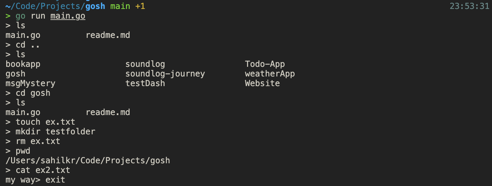

# gosh

a simple shell written in go, for fun.

as of now (while you're reading this),
it supports basic bash commands like -

- cd
- ls
- touch
- mkdir
- rm 
- pwd
- cat

basically most of it (bash), yes.

---
### screenshots
 

